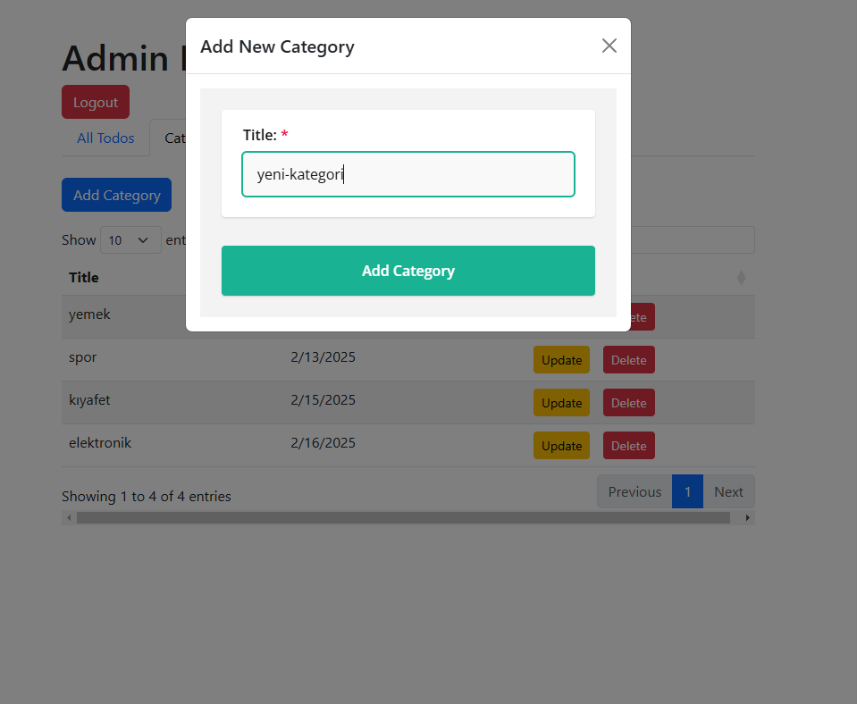

# Todo Application

Bu Todo uygulamasında aşağıdaki teknolojiler kullanılmıştır.

## Teknoloji Stack

### Backend
- **Node.js & Express.js**: RESTful API sunucusu için
- **MongoDB & Mongoose**: Veritabanı ve ODM (Object Data Modeling)
- **JWT (JSON Web Tokens)**: Kullanıcı kimlik doğrulama ve yetkilendirme
- **Bcrypt.js**: Şifre hashleme için
- **Swagger**: API dokümantasyonu için
- **Dotenv**: Ortam değişkenlerinin yönetimi
- **Node-RED**: İş akışı yönetimi
- **Socket.IO**: Gerçek zamanlı iletişim için

### Frontend
- **Vanilla JavaScript**: Temel DOM manipülasyonu ve olay yönetimi
- **jQuery**: DOM manipülasyonu ve AJAX işlemleri için (CDN)
- **DataTables.js**: Veri tablolarının yönetimi ve görüntülenmesi için (CDN)
- **SurveyJS**: Form ve anket işlemleri için (CDN)
- **Bootstrap 5**: UI framework ve responsive tasarım için (CDN)
- **Socket.IO**: Gerçek zamanlı iletişim için (CDN)
- **HTML5**: Sayfa yapısı için
- **CSS3**: Özel stil ve tasarım için

## Proje Yapısı

```
todo-app/
├── backend/
│   ├── controllers/    # İş mantığı işlemleri
│   ├── models/        # Veritabanı şemaları
│   ├── routes/        # API endpoint tanımlamaları
│   ├── middleware/    # Ara katman işlemleri
│   └── index.js       # Ana sunucu dosyası
├── frontend/
│   ├── css/          # Stil dosyaları
│   ├── js/           # JavaScript dosyaları
│   └── index.html    # Ana HTML dosyası
├── docker-compose.yaml  # Docker servis konfigürasyonları
└── .env                # Ortam değişkenleri
```

## Özellikler

- Kullanıcı kaydı ve girişi (SurveyJS form kullanarak)


- Todo ekleme, silme, güncelleme ve listeleme (DataTables.js ile)


- Kategorilerin admin tarafından yönetimi (CRUD) (Node-RED entegrasyonu ile)





- Kullanıcıya özel todo yönetimi
- RESTful API mimarisi (MVC mimarisi)
- Admin Dashboard da gerçek zamanlı Todo güncellemeleri (Kullanıcıların update,create,delete işlemleri anlık yansır) (Socket.IO ile)


- Güvenli kimlik doğrulama ve yetkilendirme
- Swagger ile API dokümantasyonu (http://localhost:3000/api-docs/)


## Kurulum ve Çalıştırma

1. Projeyi klonlayın
2. Gerekli bağımlılıkları yükleyin:
```bash
   npm install
   ```
3. `.env` dosyasını yapılandırın (MONGO_URL, JWT_SECRET, PORT) 
(Not: MONGO_URL için Mongo Atlas kullanılmıştır.)
4. node-red'i global olarak bilgisayar'a kurun 
```bash
   npm install -g node-red
   ```
5. Terminalde node-red'i çalıştırın:
 ```bash
    node-red
   ```
6. Uygulamayı başlatın:
```bash
   npm start
   ```
